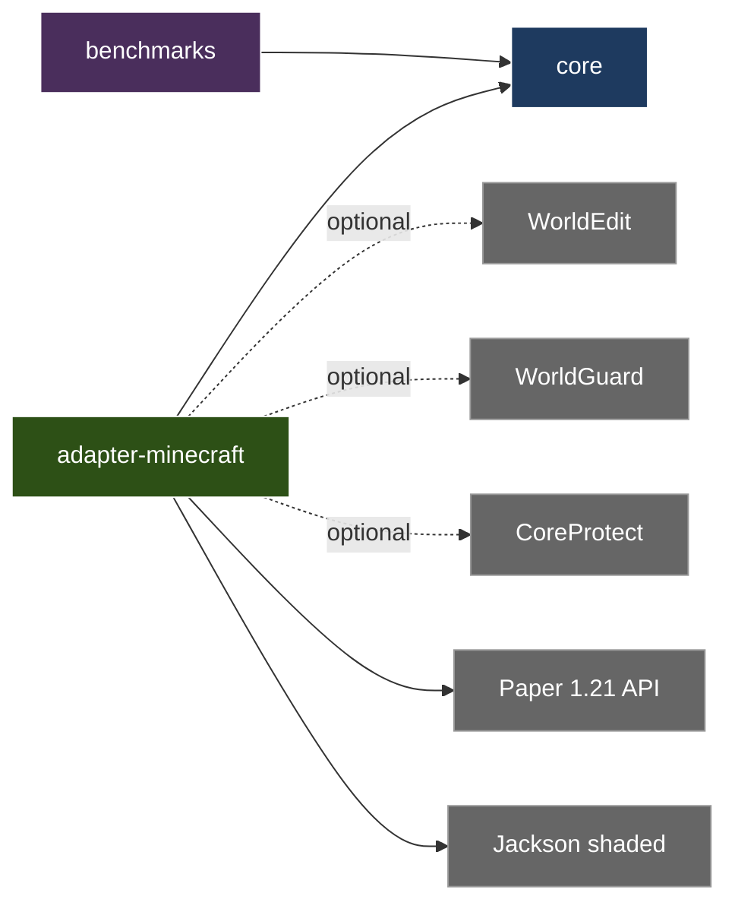

# Structural Integrity Engine

[](https://github.com/HungryDevMC/strux/actions/workflows/ci.yml)
[](https://github.com/HungryDevMC/strux/releases/latest)
[](https://papermc.io/)
[](https://hungrydevmc.github.io/strux/bench/)
[](LICENSE)

**Benchmarks:** live performance history (per-commit JMH charts) → [hungrydevmc.github.io/strux/bench](https://hungrydevmc.github.io/strux/bench/)

**Make structures collapse like real buildings!**

Ever noticed how in Minecraft you can build a floating house by removing the blocks underneath it? That's not how real life works! Strux adds realistic structural physics — knock out a support and everything above it comes crashing down in a chain reaction.

**Find your docs fast:**

- **Players** → [How buildings work](docs/wiki/player-guide/index.md) · [materials](docs/wiki/player-guide/materials.md) · [building tips](docs/wiki/player-guide/tips.md)
- **Server admins** → [Install](docs/wiki/getting-started/installation.md) · [quick start](docs/wiki/getting-started/quickstart.md) · [config](docs/wiki/config/index.md) · [admin guide](docs/wiki/admin/index.md)
- **Developers** → [How the physics works](docs/wiki/dev/physics-model.md) · [architecture](docs/wiki/dev/architecture.md) · [engine SDK](docs/wiki/dev/engine-sdk.md) · [API](docs/wiki/dev/api.md)

---

## How It Works (The Simple Version)

```
    BEFORE                              AFTER REMOVING SUPPORT
    ──────                              ───────────────────────

    [BLOCK]                             [BLOCK]
       │                                   │
    [BLOCK]                             [BLOCK]
       │                                   │
    [BLOCK]  ← You break this →            💥
       │                                   │
    [BLOCK]                             [BLOCK] ← now floating!
       │                                   │
   ═══════                              ═══════
    GROUND                               GROUND


    What happens next:

    [BLOCK]  ─┐
    [BLOCK]   │
              ├──→  CRASH! 💥
    [BLOCK]   │
    [BLOCK]  ─┘
   ═══════
    GROUND
```

---

## The Key Concepts

### 1. Every Block Has STRESS

Stress = how much weight is pushing down on this block

```
         [A]           Block A: carrying just itself (low stress)
          │
         [B]           Block B: carrying A + itself (more stress)
          │
         [C]           Block C: carrying A + B + itself (even more!)
          │
    ════════════
       GROUND          Ground: absorbs everything (infinite strength)
```

### 2. Blocks Have Physical Properties

Every block has two numbers:
- **mass** = how heavy it is
- **maxLoad** = how much weight it can hold before breaking

```
    Example: A block with mass=3.0 and maxLoad=60.0

    ┌─────────────────────────────────────────────┐
    │  This block weighs 3.0                      │
    │  It can hold up to 60.0 before breaking     │
    └─────────────────────────────────────────────┘
```

The game adapter decides what these values are for each block type!

### 3. Too Much Stress = COLLAPSE

```
    Block with maxLoad = 60

    Currently holding 45:
    ┌─────────────────────────┐
    │ [████████████░░░░░░░░░] │  75% - Still OK!
    └─────────────────────────┘

    Currently holding 70:
    ┌─────────────────────────┐
    │ [█████████████████████] │  117% - OVERLOADED! 💥
    └─────────────────────────┘

    Block breaks → everything above it recalculates → maybe more blocks break!
```

This chain reaction is called a **CASCADE**.

---

## Project Structure

```
structural-integrity/
│
├── core/                      ← The brain (pure physics, no game stuff)
│   ├── model/
│   │   ├── NodePos.java       ← Where is the node? (x, y, z)
│   │   ├── MaterialSpec.java  ← How heavy? How strong? (mass, maxLoad)
│   │   └── Node.java          ← A node + its stress info
│   │
│   └── graph/
│       └── StructureGraph.java  ← Nodes + their connections
│
├── adapter-minecraft/         ← Connects to Minecraft (defines block types)
└── benchmarks/                ← JMH perf benchmarks for the hot paths
```

**Why this split?** The core only knows physics. It doesn't know what "stone" or "wood" means - that's game-specific. Each adapter defines what blocks exist and their properties.

### Module dependencies



Adapters depend on `core`. `core` has **zero runtime deps** — that's a hard rule enforced
by `CoreHasNoGameTypesTest`. Per-module deep-dives:

- [`core/README.md`](core/README.md) — what's in core, the test harness, the no-game-types rule
- [`adapter-minecraft/README.md`](adapter-minecraft/README.md) — Bukkit/Paper binding, optional integrations, config

---

## The Building Blocks (Pun Intended)

> **Note:** the core is *unit-agnostic* — it reasons about **nodes** and **edges**, not
> "blocks". A node can be a 1×1×1 block, a prefab, or a truss joint. The classes are named
> `Node` / `NodePos` (not `BlockNode` / `BlockPos`). See `DESIGN.md`.

### NodePos - "Where is it?"

Just three numbers: x, y, z

```java
NodePos pos = new NodePos(10, 5, 3);
// This node is at x=10, y=5 (5 blocks up), z=3
```

### MaterialSpec - "What are its physical properties?"

Two numbers: mass and maxLoad

```java
// A light block that can hold moderate weight
MaterialSpec light = new MaterialSpec(1.0, 20.0);

// A heavy block that can hold a lot of weight
MaterialSpec heavy = new MaterialSpec(4.0, 100.0);

// Ground - infinite strength (never breaks)
MaterialSpec.GROUND  // mass=0, maxLoad=∞
```

### Node - "A node in our world"

```java
Node node = new Node(pos, spec, false);
// A node at position 'pos' with properties 'spec', not grounded (third arg = grounded)

node.stressPercent();  // How stressed is it? (0.0 to 1.0+)
node.isOverloaded();   // Is it about to break?
```

---

## What's Inside

The engine is well past the tutorial stage. What ships today:

**Core physics (`core/`)**

- **One-pass stress solver** — vertical load + cantilever moments resolved in a single
  topological pass, not iterated to convergence.
- **Cascading collapse** — one overload propagates through the structure; cascades can be
  **resumed** across ticks so a big collapse never blocks the server.
- **Blast engine** — cumulative blast damage with falloff and occlusion, plus kinetic
  impact / penetration (energy, not a damage table) and fire degradation.
- **Reinforcement & structural grades** — raise a node's capacity; score a build S/A/B/C/F.
- **Collapse prediction** — assess what *would* fall without actually dropping it.
- **Record / replay + verify** — capture a scenario, replay it deterministically, and
  verify the replay reproduces the original collapse (`ReplayEngine`). A
  `RecordingService` exposes this for gamemodes.

**Minecraft adapter (`adapter-minecraft/`)**

- **Tick-budget seatbelts** — impact, fire, and weather passes each cap their per-tick work
  (`*.tick-budget-ms`) so physics stays on the main thread without lag spikes.
- **Optional, auto-detected integrations** — per-world / region toggles, WorldGuard
  (`strux-physics` flag), CoreProtect (rollback-able collapse logging), Vault (costs),
  PlaceholderAPI (`%strux_*%`). Missing plugins are simply skipped.
- **Console / RCON `/strux record`** — operator tooling for recording, listing, replaying,
  and verifying scenarios.

> Perf is checked on **every** change by a deterministic work-count gate (`PerformanceGateTest`)
> and by JMH benchmarks under `benchmarks/`. See [CONTRIBUTING.md](CONTRIBUTING.md).

---

## Minecraft Adapter

The `adapter-minecraft` module connects the physics engine to Paper/Spigot servers.

### Key Components

- **MaterialRegistry** — Maps Minecraft materials to physical properties (mass, maxLoad, blast/fire resistance)
- **BlockBreakListener** / **BlockPlaceListener** — Route break/place events into the core
- **ExplosionListener** / **ProjectileImpactListener** — Blast and kinetic-impact damage
- **CascadeResumeManager** / **DelayedCollapseManager** — Spread big collapses across ticks
- **RecordingService** — Record / replay / verify scenarios (also driven by `/strux record`)

Full command, permission, and integration reference lives in the
[admin guide](docs/wiki/admin/index.md) and
[`adapter-minecraft/README.md`](adapter-minecraft/README.md).

### Material Properties

```
Block Type          Mass    MaxLoad    Notes
──────────────────────────────────────────────────────────
Stone               3.0     100.0      Heavy, very strong
Wood (logs)         1.0     40.0       Light, moderate
Planks              0.8     28.0       Lighter than logs
Dirt/Grass          2.0     20.0       Medium, weak
Iron Block          5.0     150.0      Heavy, very strong
Glass               0.5     5.0        Light, fragile
Leaves              0.1     1.0        Decorative only
Bedrock             ∞       ∞          Unbreakable ground
```

### Installation

1. Build the shaded plugin jar: `./gradlew :adapter-minecraft:shadowJar`
   (the standard `build` task runs `shadowJar` too).
2. Copy the jar from `adapter-minecraft/build/libs/` to your server's `plugins/` folder.
3. Restart the server. Target: Paper (and forks), `api-version 1.21`, Java 21+.

---

## Building the Project

Needs **JDK 21** (Gradle 9). If `java` isn't on your PATH, point `JAVA_HOME` at a JDK 21:

```bash
./gradlew build          # full build: all modules + tests + spotlessCheck
./gradlew :core:test     # core physics tests + snapshot regression + perf gate
```

See [CONTRIBUTING.md](CONTRIBUTING.md) for the test harness, snapshots, and JMH benchmarks.

---

## Contributing

See [`CONTRIBUTING.md`](CONTRIBUTING.md) for build, test, and conventions. Security
issues: please email privately — see [`SECURITY.md`](SECURITY.md).

## License

[Business Source License 1.1](LICENSE) — free to use, run, and modify on a **single server** (including a commercial one). Running it across a network / multiple servers / a horizontally-scaled setup needs a paid **Enterprise** license (coming later), which adds horizontal scaling and support. Source-available; converts to Apache 2.0 on the Change Date. Bundled third-party libraries keep their own licenses ([THIRD-PARTY-NOTICES.md](THIRD-PARTY-NOTICES.md)).

## History

This is a curated public mirror of a private development repository. The history here starts at the 1.0.0 release, and ongoing development continues in this repo.
