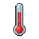
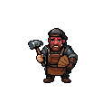

# Temperature & Heat Strength 

<div class="page-aside"></div>


Hot blocks get **weaker**. A steel beam in a fire sags. Stone next to lava
softens. Wood chars away. This page explains how strux turns a block's
temperature into lost strength, and how to tune it. All keys live under the
`temperature-strength:` section of `config.yml`.

This feature is **off by default**. When it is off, temperature never changes
anything — physics is exactly as it was before.

---

## What it does

Every block has a load **capacity** — how much weight it can hold before it
breaks. When this feature is on, that capacity shrinks as the block heats up.

A block that was safely holding a roof can suddenly fail once it gets hot enough,
and the roof comes down. Cool it back to normal and it is strong again (unless it
already cracked — see thermal shock below).

---

## The real curves

Strux does not invent the numbers. It uses the same strength-vs-temperature
curves that fire engineers use, one per material family:

| Family | Holds full strength to | Half strength near | Gone (≈0) by | Source |
|---|---|---|---|---|
| **Metal** (iron, gold, copper, …) | ~400 °C | ~570 °C | ~1200 °C | Eurocode 3 (steel `k_y,θ`) |
| **Masonry** (stone, brick, concrete, glass, …) | ~100 °C | ~570 °C | ~1100 °C | Eurocode 2 (concrete `k_c,θ`) |
| **Wood** (logs, planks, …) | ~100 °C | ~200 °C | ~300 °C (char) | char-front model |

Between the listed points the strength is interpolated in a straight line — an
honest reading of measured data, not a made-up multiplier.

So at **600 °C**, a steel block keeps about **47%** of its strength, concrete
about **45%**, and wood is already gone.

---

## How hot is hot? (the °C mapping)

Minecraft has no thermometer, so strux maps its blocks to plausible real
temperatures:

| Source | Temperature |
|---|---|
| Lava | ≈ 1100 °C |
| Fire / soul fire | ≈ 800 °C |
| Magma block | ≈ 400 °C |
| Snowy / frozen biome ambient | ≈ −10 °C |
| Temperate biome ambient | ≈ 20 °C |
| Desert / badlands ambient | ≈ 45 °C |
| Nether ambient | ≈ 60 °C |

A nearby **ice or snow** block pulls a block's local ambient down toward
freezing.

A heat source's effect **fades with distance** and **through solid blocks**. So
the outside face of a thick wall cooks while its interior stays cooler — and
therefore stronger. A thick wall really does resist heat better. (Tune this with
`solid-insulation-blocks`.)

---

## Thermal shock (heat, then douse)

Heat a brittle block — stone, brick, fired ceramic — and then suddenly cool it
(throw water on it, let rain hit it, or remove the lava) and it **cracks**. The
crack is permanent damage, like a hit from an explosion.

This is the siege tactic: heat an enemy wall with fire, then douse it, and it
shatters. Ductile materials (metal, wood) barely care — only brittle ones crack.
The crack only fires for a cooling that happens while the block is under load — a
block that heated up, calmed down, and is only stressed much later won't shock-crack
from that old, forgotten heat.

- `shock-onset-c` — a temperature drop smaller than this cracks nothing.
- `shock-span-c` — a drop this much past the onset cracks the block as hard as it
  can.

---

## Settings

```yaml
temperature-strength:
  # Master switch. false = temperature never changes capacity (default).
  enabled: false

  # The °C of an unheated block in a temperate biome.
  comfort-temperature-c: 20.0

  # Thermal shock: the smallest sudden DROP (°C) that cracks anything.
  shock-onset-c: 150.0
  # The drop past the onset at which cracking is maxed out.
  shock-span-c: 500.0

  # How far (blocks) to look for heat sources around each tracked block.
  scan-radius: 5
  # Distance at which a source's heat halves.
  heat-falloff-radius: 4
  # Extra falloff per solid block in the way (the "thick wall" knob).
  solid-insulation-blocks: 3.0

  # How often the scan runs (ticks; 40 = 2 seconds).
  scan-interval-ticks: 40
  # Most ms one scan may spend before it yields the tick.
  tick-budget-ms: 10.0
```

---

## Per-material tuning

Each block already has a thermal family by default (metals → steel curve,
stone/brick/glass → masonry curve, logs/planks → wood curve). You change a
block's other properties — mass, max load, blast, fire — through the usual
`materials:` overrides; the thermal family is kept when you do.

A block's thermal family is now **saved with the world** and survives a restart.
Before, a steel beam reloaded after a restart forgot it was steel and stopped
weakening in heat until it was touched again; now it keeps its family across
save and load. Old save files made before this fix have no family stored, so
every block in them loads as "no temperature softening" (the same strength they
had on the old version) until it is next placed.

---

## What this is NOT

This is a **material-strength** model: it lowers how much a hot block can carry.
It is **not** a full thermal-stress simulation — strux does not compute the
internal stresses that uneven heating and expansion create inside a block. That
is a deliberate omission to keep the physics fast and easy to follow. Thermal
shock is the one nod to transient heating effects, and even it is a calibrated
crack, not a heat-flow equation.

Temperature never touches **moisture** — that is the weather system's job — and a
block that fire is **already actively burning** is left to the fire model alone,
so heat is never counted against the same block twice.
