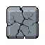
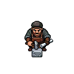

# How the Physics Works 

The whole calculation system, in plain terms. No code knowledge needed — this is
the mental model behind every collapse you see.

The numbered sections are the plain-language model — read those and you'll
understand every collapse. If you want the underlying detail (the textbook laws
it's checked against, and what it deliberately gets wrong), there's a **deep
dive** at the end for the curious.

## 1. The world becomes a web of weights

Strux doesn't think about "blocks". It keeps a map of **nodes** (things with a
weight) connected by **edges** (faces touching). Some nodes are **grounded**
(bedrock, terrain): they are the anchors everything must ultimately hang from.
Every material gets its numbers from the adapter: how much it **weighs**, how
much it can **carry** (stone carries a lot, glass very little), and how well it
resists **blasts** and **fire**.

## 2. "How far am I from the ground?"

When something changes, the solver first labels every block in the affected
structure with its **distance to the nearest ground** — like counting how many
steps a load must travel before it reaches earth. This one number drives
everything else.

## 3. Weight flows downhill (the vertical pass)

The solver processes blocks **farthest-from-ground first**, and each block's
stress is:

> *my own weight + my share of the weight of every block leaning on me*

When a block's load could flow down through several neighbors, it splits
**equally among the neighbors one step closer to ground** (every valid
supporter is exactly one step closer, so there is no tie to break). Load only
ever flows to a *strictly* closer neighbor, so the shares always sum to exactly
1 and no weight evaporates en route. Grounded blocks absorb everything and
never stress.

## 4. The lever effect (the moment pass)

Vertical weight isn't enough — a horizontal beam sticking out of a wall holds
little weight *directly above it* but still snaps. So there is a second pass for
**cantilevers**. Holding a bucket at arm's length is harder than holding it at
your chest. For every block at the base of an unsupported arm:

> *moment stress = the arm's total weight × how far it sticks out*

If the arm reaches ground on **two** ends it is a bridge, not a cantilever —
supported on both sides, no lever penalty.

**A block's total stress = vertical + lever.** No special cases, no hidden
multipliers.

## 5. Can it take it?

Each block compares its stress against its capacity:

> *capacity = material's max load × (1 − damage) × reinforcement*

Damage comes from blasts, projectile hits, and fire — they all feed the same
crack meter. A Support Beam reinforcement raises capacity. Over 100% → the block
fails. The cracks players see are literally this ratio drawn on the block.

## 6. Failure spreads (the cascade)

When blocks fail, the cascade engine takes over, in a loop:

1. Remove the failed blocks (they become falling debris).
2. Anything with **no remaining path to ground** falls too — it is floating.
3. Falling debris **damages what it lands on**.
4. Re-solve the survivors — the dead blocks' load gets redistributed onto their
   neighbors, which may now overload…
5. Repeat until everything left is stable.

A break or impact cascade collapses at most a fixed number of blocks per tick
(the step cap, default 50) and then **resumes** on the next tick — so a giant
collapse plays out over several ticks instead of freezing the server, and
nothing is left stranded. Floating blocks (no path to ground) are exempt from
the cap and always drop immediately. (Explosions run their own, separate,
*uncapped* collapse pass over just the blast-affected region.)

Crucially, failure is **progressive**: a block fails *before* passing its full
load onward. When a pillar dies, the bridge snaps near the dead pillar instead
of teleporting all its weight to the far one.

## 7. Only what matters, in a fixed order

Two properties keep this fast and trustworthy:

- Every solve is **scoped** to the one structure that changed. A 100k-block
  world doesn't get re-solved because someone broke a fence on the other side
  of the map.
- Blocks that fail together are processed in a **fixed canonical order**, so the
  same hit produces the exact same collapse every time. This is what makes
  record/replay verification possible.

In one line: **count steps to ground → flow weight down → add the lever
penalty → compare to capacity → let failures spread until quiet.**

## Deep dive: how accurate is the model, really?

*This section is for the curious — the plain-language model above is all you need
to play.*

Honestly: strux is a *plausibility model*, not an engineering simulator. It is
checked against three kinds of north star, in increasing distance from the
code:

1. **Internal invariants** (exact, always checkable). Determinism (same input,
   same collapse — enforced by replay verification, and the affected-region
   closure of a disturbance is independent of the order blocks are visited, so
   it never drops a sideways load path in one ordering but not another),
   no floating blocks after a
   settle, scoped solves matching whole-world solves (a scoped solve handed only
   the blocks that lean on a change is widened to its support before solving, so
   it can never silently fall back to own-weight-only stress), settling independent
   structures in parallel landing on exactly the graph the serial engine would
   (same survivors, same debris damage, same resume scope — even when one cluster
   is cut short by the step cap), and the fast batch
   cascade solver matching the full solver block-for-block — even on wide,
   solid structures where some interior blocks are too obviously stable to
   re-check (a block whose load they carry must still feel that weight; this
   caught a real bug where the batch path read a stale, zeroed stress off a
   skipped block and missed an overload). These can never prove the physics
   *realistic*, only *self-consistent*.
2. **Textbook scaling laws** (closed-form checks built into the engine's test
   suite). A stack of N
   blocks puts exactly N−1 blocks of weight on the bottom one. A uniform
   cantilever's root moment grows with the *square* of its length (arm weight
   ∝ L, times reach ∝ L) — the same L² law as the real Euler–Bernoulli result
   for a uniform beam. An arm grounded at both ends carries no moment. A
   symmetric bridge splits its deck exactly in half, and weight is conserved
   level-by-level on its way to ground — on *every* connected structure (a
   conservation law that already caught one real bug: weight used to silently
   evaporate between same-distance neighbours). Cascades obey their own laws:
   every block is accounted for (survivor, casualty, or trigger), a finished
   cascade is truly finished (nothing floating, nothing overloaded, a second
   settle is a no-op), grounded anchors are never consumed, and a broken
   column drops exactly the blocks above the break — checked on canonical
   shapes and a pinned-seed random sweep. The blast laws are pinned the same way
   (the destroyed / collapsed / damaged sets stay pairwise disjoint, on
   canonical shapes and a pinned-seed sweep), and the fast one-pass moment-arm
   solver is proven to agree bit-for-bit with the slower per-anchor walk it
   replaced. Where the model matches the textbook *shape* of
   the answer, tuning material numbers can make the magnitudes feel right.
3. **What it deliberately gets wrong.** No tension/compression split (players
   can't perceive crack orientation; it would tax the hot path). A beam is no
   stronger for being thicker or deeper (see "Bending moments" on the roadmap).
   No buckling, no rigid-body tipping (a building with all its pillars on one
   side overloads block-by-block instead of toppling — see "Global tipping
   physics" on the roadmap). **No stiffness-style lateral load sharing:** load
   flows only *downhill* to strictly-closer neighbours, so a parallel support
   path of equal or longer length carries nothing — bracing an overloaded
   column from the side does nothing unless the new path is strictly shorter to
   ground. Real structures share by stiffness (every path takes load in
   proportion to how stiff it is), which needs an iterative relaxation solve
   rather than the current one-pass downhill flow (see "Lateral load sharing" on
   the roadmap; a conservation check guards against
   re-introducing the old same-distance rule that *looked* like sharing but
   silently evaporated the sideways share). These are conscious trade-offs,
   listed so nobody mistakes the model for an FEM solver.

The design philosophy is simple: keep the physics *honest* — every number a
block feels must come from real mass, real distance, real damage — and make it
*feel* right by tuning material values, never by adding fake safety multipliers.
