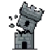

# Welcome to Strux! 

<div class="page-aside"></div>


!!! mason "The Mason says…"
    Welcome — I'm the Strux Mason! I keep your builds standing, and I'll flag the
    tricky bits as we go. Let's dig in.

_Docs are drafted with AI help and human-reviewed. Spot an error? [Open an issue](https://github.com/HungryDevMC/strux/issues)._

---

## What is Strux?

**Strux makes buildings fall down — just like real life!**

In normal Minecraft, you can build a house floating in the sky. The blocks just... stay there. That's weird, right?

```
Normal Minecraft:        With Strux:

   🏠 House               🏠 House
     |                       |
   (air)                  [Pillar]
   (air)         →        [Pillar]
   (air)                  [Pillar]
  ═════                   ═════
  Ground                  Ground

Floats! Magic!           Needs support!
```

**Strux fixes that!** Now blocks are heavy. If you don't hold them up, they fall!

---

## Strux is free

Strux is **free on a single server** — the whole engine, every feature.
Realistic collapse, the stress overlay, explosions, fire, weather, reinforcement,
structural grades, protection-plugin support — all of it, free, including on a
commercial server. There's no paywalled "pro" tier holding back the good stuff.

It's licensed under the [Business Source License 1.1](dev/index.md#license): use,
run, and modify it freely on one server. The source is public so you can audit it.

!!! note "Running a network?"
    Using Strux across a **network or multiple servers** needs an **Enterprise**
    license (coming later) — a monthly plan that adds **horizontal scaling**
    (moving the heavy collapse work off the game server, so it holds up on the
    largest networks) and **support**. The single-server engine is the full
    thing, free.

---

## Find Your Docs

### For Players

You build, Strux decides what stands and what falls. Start with [**How Buildings
Work**](player-guide/index.md) to learn why things collapse, then check [**Building
Materials**](player-guide/materials.md) for what's heavy vs. strong. Watch out for
[**Damage & Hazards**](player-guide/hazards.md) (TNT, fire, weather) and pick up
[**Building Tips**](player-guide/tips.md) to keep your towers up.

### For Admins

Drop the jar in and it just works. Follow [**Installation**](getting-started/installation.md)
and the [**Quick Start**](getting-started/quickstart.md) to get running, then tune everything
in the [**Configuration**](config/index.md) reference. The [**Admin
Guide**](admin/index.md) covers commands, permissions, and protecting spawn.

### For Developers

Strux is built to be built on. Start with the [**Developer Guide**](dev/index.md) —
the API contract, a 60-second example, and best practices. Then go deeper with
[**How the Physics Works**](dev/physics-model.md) for the model, the [**API
Reference**](dev/api.md) to hook into the running plugin, or the [**Engine
SDK**](dev/engine-sdk.md) to embed the engine in your own project.

---

## See It In Action

```
You place a block...

   [New Block]  ← You put this here
       |
   [Old Block]  ← This block now has to hold more weight!
       |
   [Ground]

If [Old Block] can't hold [New Block]...

   💥 CRASH! 💥

   [New Block] falls!
   [Old Block] breaks!
```

---

## Need Help?

- 📖 [For Players](player-guide/index.md)
- 🔧 [For Admins](admin/index.md) — server setup
- 🐛 [Report an issue](https://github.com/HungryDevMC/strux/issues)
