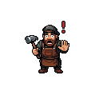

# Dangerous Things 

<div class="page-aside left"></div>


Your buildings have enemies! Here's what can hurt them.

Every hazard below is a config setting. They're all on by default, and your server admin can turn any of them off.

---

## 💥 Explosions (TNT & Creepers)

**BOOM!** Explosions are the scariest thing for buildings.

1. **Direct hit** — blocks are destroyed.
2. **Nearby blocks** — get cracked and weakened.
3. **Weakened blocks** — might collapse on their own a moment later.

Tough blocks (obsidian, netherite, deepslate) shrug off blasts. Glass and sand shatter easily.

!!! danger "Watch Out!"
    A creeper near your house can weaken walls without destroying them. They may come down on their own.

---

## 🔥 Fire

Fire slowly cooks your building.

A flammable block touched by flame chars away **fast**. Any block next to fire or lava heats up **slowly** — so a long enough fire can even cook a stone or metal frame down.

| Block | How Fast It Weakens |
|-------|----------------------|
| Wood, wool, leaves | Super fast — burns away |
| Stone, brick | Very slow |
| Iron, copper | Slow (heats up, loses strength) |
| Obsidian, netherite | Almost fireproof |

!!! tip "Put it out!"
    Water and rain extinguish fire. A fire with nothing flammable next to it (like a flame on bare stone) has no fuel and **burns out on its own** after about 30 seconds. Keep the fire fed and it'll keep eating the wall.

---

## 🏹 Projectiles (Arrows, Fireballs, Ram Strikes)

Flying things damage walls by their **kinetic energy** — how heavy *and* how fast they are.

```
Light arrow:
🏹 ──────→ *crack* [WALL]   (tiny scratch)

Heavy trident / fireball:
●═════════→ *SMASH* [WALL]  (punches through!)
```

**Faster + heavier = more damage.** A slow arrow barely scratches; a fast trident bores in.

!!! note "One projectile, one hit"
    A projectile only damages a wall **once**, when it lands. An arrow stuck in a block just sits there — it does **not** keep chipping away. Want more damage? Fire more shots. Ten light hits can break a wall that one can't.

Hits don't always resolve the same instant they land — during a heavy volley, the server may settle them a tick later so it never freezes. You won't notice in normal play.

---

## 🌧️ Weather

Mother Nature can hurt your buildings too. Only blocks with open sky above them are affected — interiors are safe. Weather effects arrive over a few seconds, not all at once.

### Rain ☔

Rain makes exposed blocks **5% weaker** while it's falling. Usually not a big deal — but a structure already at its limit can tip over.

### Thunder ⛈️

A thunderstorm makes exposed blocks **12% weaker**, and lightning can send a random stress spike through a building.

!!! warning "Thunder is dangerous"
    A building that's already stressed can collapse in a thunderstorm.

### Snow ❄️

In cold biomes, snow piles up on exposed blocks and slowly adds weight, up to about 30% of a block's capacity. A flat roof in a snowy place can sag and fall.

!!! tip "Stay safe from snow"
    - Build sloped roofs so snow can't pile up.
    - Clear the snow off now and then (removing the snow above relieves the load).

---

## 🧍 Standing on Weak Floors

You and every mob have weight. Standing on an **already-weak** block can be the last straw.

```
   🧍 You (weight: 2.0)
    ↓
   [Cracked Floor]  ← already heavily loaded

   load + your weight = TOO MUCH → 💥
```

!!! tip "Healthy floors don't care"
    Your weight only matters on a block that's heavily stressed (70%+) or already damaged (50%+). Walking on a healthy floor is completely safe.

---

## 🪂 Falling From High Up

Jumping onto a weak floor from height hits much harder than walking — the impact grows with how far you fall.

| Fall Distance | Effect on a weak floor |
|------------------|---------|
| Under 2 blocks | Ignored |
| 2–5 blocks | Might break it |
| 10 blocks | Probably breaks it |
| 20+ blocks | Almost certainly breaks it |

Like standing weight, this only affects floors that are **already weak**. A healthy floor takes the landing fine.

---

## 📦 Heavy Storage

A full chest, barrel, or shulker box is **heavy**. The block it sits on holds that weight, just like a floor holds you.

```
   📦 Full chest (heavy!)
   ───────────────────
   weak floor block
   ───────────────────
   load + chest weight = TOO MUCH → 💥
```

An **empty** chest barely weighs anything. The more loot you pile in, the heavier it gets — a chest packed to the brim weighs the most.

> [!TIP]
> Like standing weight, this only matters on a block that's **already weak** (70%+ stressed or 50%+ damaged). A heavy chest on a healthy floor is totally fine. But don't stack a full chest on a cracked floor over a long drop!

---

## Summary: What Hurts Buildings?

| Danger | How Bad |
|--------|---------|
| Explosions | 💀💀💀 Very bad |
| Fire | 💀💀 Bad for wood, slow for stone |
| Projectiles | 💀 Small per hit, adds up |
| Rain | 😐 A little (5% weaker) |
| Thunder | 💀 Can be bad (12% weaker + spikes) |
| Snow | 💀 Piles up over time |
| Standing on weak floors | 💀 Only if already weak |
| Falling on weak floors | 💀💀 Worse the higher you fall |
| Heavy storage on weak floors | 💀 Fuller = heavier, only if already weak |

---

## Next Steps

- [Building Tips](tips.md) — How to make buildings safer!
- [What Blocks to Use](materials.md) — Strong vs weak blocks
