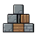

# What Blocks to Use 

<div class="page-aside"></div>


Not all blocks are the same! Some are strong, some are weak. Here's what to use.

---

## The Block Report Card

Two numbers matter: **weight** (how heavy) and **strength** (how much it can hold).

| Block | Weight | Strength | Good For |
|-------|:------:|:--------:|----------|
| Bedrock / Barrier | ∞ | ∞ | Unbreakable foundation |
| Netherite Block | 7.0 | 300 | Strongest base there is |
| Obsidian | 4.5 | 200 | Bunker walls |
| Diamond Block | 4.0 | 200 | Very strong base |
| Iron Block | 5.0 | 150 | Strong base (heavy!) |
| Deepslate | 3.6 | 130 | Strong base |
| Concrete | 3.5 | 120 | Strong walls |
| Copper Block | 4.5 | 120 | Strong base |
| Stone / Cobblestone | 3.0 | 100 | Walls and foundations |
| Stone Bricks | 3.0 | 120 | Reinforced walls |
| Brick | 2.5 | 80 | Solid walls |
| Gold Block | 6.0 | 80 | Heavy and soft — looks only |
| Wood Logs | 1.0 | 40 | Light beams and frames |
| Wood Planks | 0.8 | 28 | Light walls and roofs |
| Dirt / Grass | 2.0 | 20 | Weak — not for height |
| Glass | 0.5 | 5 | Windows only! |
| Wool | 0.3 | 3 | Decoration, roofs |
| Hay Block | 0.4 | 5 | Decoration |
| Sand | 2.0 | 6 | Very weak |
| Leaves | 0.1 | 1 | Looks only |

Heavier blocks push down harder. Stronger blocks can hold more before they break. Your admin can change any of these values in config.

---

## Good Blocks for Building

### For the Bottom (Foundation)

Put your **strongest** blocks at the bottom — they carry everything above.

```
GOOD:                  BAD:

  [Wood Roof]           [Stone Roof]
  [Stone Wall]          [Glass Wall]   ← Weak!
  [Stone Wall]          [Glass Wall]   ← Weak!
  ════════════          ════════════
    Ground               Ground
                        💥 CRASH! 💥
```

**Best foundation blocks:** Netherite, Obsidian, Diamond, Iron, Deepslate, Stone.

### For the Top (Roof)

Put **light** blocks on top so the walls aren't overloaded.

```
GOOD:                  BAD:

  [Wood] [Wood]        [Iron] [Iron]  ← Too heavy!
      \   /                \   /
       [Wall]               [Wall]
                              💥
```

**Best roof blocks:** wood planks, wool, slabs, leaves (just for looks).

### For Windows

Glass is **weak**. Only use it for windows, never walls.

```
GOOD:                          BAD:

[Stone][Glass][Stone]          [Glass][Glass][Glass]
[Stone][Glass][Stone]          [Glass][Glass][Glass]
[Stone][Stone][Stone]          [Glass][Glass][Glass]
════════════════════           ════════════════════
Windows = OK!                  All glass = 💥 CRASH!
```

---

## Creatures Have Weight Too!

Players and mobs add weight when they stand on a block.

| Creature | Weight |
|----------|:------:|
| Rabbit / Parrot | 0.2 |
| Chicken | 0.3 |
| Cat | 0.5 |
| Wolf | 1.2 |
| Skeleton | 1.5 |
| You (Player) | 2.0 |
| Zombie | 2.0 |
| Cow | 3.0 |
| Horse | 4.0 |
| Ravager | 6.0 |
| Iron Golem | 8.0 |
| Warden | 10.0 |
| Ender Dragon | 15.0 |

!!! tip "Healthy floors are safe"
    A creature's weight only matters on a block that is **already weak** — one that's heavily stressed (70%+) or already damaged (50%+). Walking across a healthy floor is totally fine. But an Iron Golem on a cracked floor can be the last straw!

---

## The Perfect Building

```
        [Wood Roof]        ← Light on top
        [Wood Roof]
       ─────────────
      |             |
[Stone Wall]   [Stone Wall] ← Strong walls
[Stone Wall]   [Stone Wall]
      |             |
[Iron]────────────[Iron]    ← Super strong base
═══════════════════════════
         Ground
```

**Remember:**

- Light stuff on top.
- Heavy, strong stuff on the bottom.

---

## Next Steps

- [Dangerous Things](hazards.md) — TNT, fire, and more!
- [Building Tips](tips.md) — Pro building tricks
